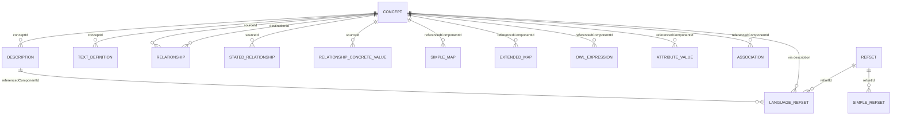

# SNOMED CT RF2 Data Reference

**Purpose:** Reference for ingesting `SnomedCT_InternationalRF2_PRODUCTION_20260601T120000Z` into a denormalized Postgres concept table for the open terminology server.

**Release:** SNOMED CT International Edition, effective date **20260601** (June 2026).

**Root path:**

```
SnomedCT_InternationalRF2_PRODUCTION_20260601T120000Z/
```

---

## 1. Format fundamentals

| Property | Value |
|---|---|
| Encoding | UTF-8 |
| Delimiter | Tab (`\t`) |
| Structure | One file = one relational table; row 1 = column headers |
| Line ending | Unix (`\n`) |
| Component IDs | Numeric SCTIDs (concepts) or UUIDs (refset members) |

### RF2 versioning model (every component row)

Every row is a **version** of a component, not just the component itself.

| Column | Meaning |
|---|---|
| `id` | Stable component identifier (same across versions) |
| `effectiveTime` | Version date as `YYYYMMDD` (e.g. `20170731`) |
| `active` | `1` = current for that version; `0` = inactive/retired |
| `moduleId` | Owning SNOMED module (concept SCTID) |

### Snapshot vs Full

| View | Meaning | Use for Postgres |
|---|---|---|
| **Snapshot/** (~1.4 GB) | One row per component = **current state** at release date | **Recommended** for terminology server |
| **Full/** (~2.2 GB) | **All historical versions** of every component | Use only if you need version history / delta updates |

For a light authoring/read server, ingest **Snapshot only**.

---

## 2. Folder layout

```
SnomedCT_InternationalRF2_PRODUCTION_20260601T120000Z/
├── Readme_en_20260601.txt
├── release_package_information.json
├── Snapshot/                          ← ingest this
│   ├── Terminology/                   ← core SNOMED components (8 files)
│   └── Refset/
│       ├── Language/                  ← preferred/acceptable terms
│       ├── Map/                       ← ICD-10, legacy maps
│       ├── Content/                   ← refset membership, associations, attributes
│       └── Metadata/                  ← refset definitions, MRCM rules
└── Full/                              ← same structure, all history
```

---

## 3. Entity relationship model



**Central entity:** `Concept` (SCTID). Everything else hangs off concepts or descriptions.

---

## 4. Terminology files (`Snapshot/Terminology/`)

### 4.1 `sct2_Concept_Snapshot_INT_20260601.txt`

**~532K rows | Primary table**

| Column | Type | Description |
|---|---|---|
| `id` | SCTID | Concept identifier (PK with versioning) |
| `effectiveTime` | YYYYMMDD | Version date |
| `active` | 0/1 | `1` = concept exists and is usable |
| `moduleId` | SCTID | Owning module (usually `900000000000207008` = Core) |
| `definitionStatusId` | SCTID | `900000000000074008` = Primitive; `900000000000073002` = Fully defined |

**Relationships:**

- Root of SNOMED hierarchy: concept `138875005` (SNOMED CT Concept)
- `moduleId` → Concept (module is itself a concept)
- `definitionStatusId` → Concept (metadata concepts)

---

### 4.2 `sct2_Description_Snapshot-en_INT_20260601.txt`

**~1.7M rows | Human-readable terms**

| Column | Type | Description |
|---|---|---|
| `id` | SCTID | Description component ID |
| `effectiveTime` | YYYYMMDD | Version date |
| `active` | 0/1 | Whether this description version is active |
| `moduleId` | SCTID | Owning module |
| `conceptId` | SCTID | **FK → Concept.id** |
| `languageCode` | string | `en` |
| `typeId` | SCTID | Description type (see §8) |
| `term` | string | The text (FSN, synonym, etc.) |
| `caseSignificanceId` | SCTID | Case sensitivity rule |

**Key `typeId` values:**

- `900000000000013009` — Fully Specified Name (FSN), always present for active concepts
- `900000000000003001` — Synonym

**Relationships:**

- `conceptId` → `Concept.id`
- Description `id` → `Language refset.referencedComponentId` (for preferred/acceptable)

---

### 4.3 `sct2_TextDefinition_Snapshot-en_INT_20260601.txt`

**~19K rows | Formal definitions**

Same columns as Description. `typeId` = `900000000000550004` (Text definition).

Longer prose definitions (e.g. "A decrease in lower leg circumference due to...").

---

### 4.4 `sct2_Relationship_Snapshot_INT_20260601.txt`

**~3.6M rows | Inferred semantic relationships (the taxonomy + attributes)**

| Column | Type | Description |
|---|---|---|
| `id` | SCTID | Relationship ID |
| `effectiveTime` | YYYYMMDD | Version date |
| `active` | 0/1 | Active relationship |
| `moduleId` | SCTID | Owning module |
| `sourceId` | SCTID | **FK → Concept** (subject) |
| `destinationId` | SCTID | **FK → Concept** (object/value) |
| `relationshipGroup` | int | Groups attributes (`0` = ungrouped / IS-A) |
| `typeId` | SCTID | Relationship type (attribute concept) |
| `characteristicTypeId` | SCTID | `900000000000011006` = Inferred |
| `modifierId` | SCTID | `900000000000451002` = Some (existential) |

**Most important `typeId`:**

- `116680003` — **Is a** (taxonomy/hierarchy). Always `relationshipGroup = 0`.

**Other common attribute types:** `246075003` (Causative agent), `363698007` (Finding site), `42752001` (Due to), etc.

**Query pattern — parents of a concept:**

```sql
SELECT destinationId FROM relationship
WHERE sourceId = ? AND typeId = 116680003 AND active = 1;
```

**Query pattern — children:**

```sql
SELECT sourceId FROM relationship
WHERE destinationId = ? AND typeId = 116680003 AND active = 1;
```

---

### 4.5 `sct2_StatedRelationship_Snapshot_INT_20260601.txt`

**~1.0M rows | Author-stated relationships (pre-inference)**

Same schema as Relationship, but `characteristicTypeId` = `900000000000010007` (Stated).

Used by SNOMED authoring/MRCM. For a read-only server, **Relationship (inferred) is usually sufficient** for hierarchy and attributes. Stated is optional unless you need authoring or stated-vs-inferred comparison.

---

### 4.6 `sct2_RelationshipConcreteValues_Snapshot_INT_20260601.txt`

**~37K rows | Relationships with literal values (not concept destinations)**

| Column | Notes |
|---|---|
| `sourceId` | Concept |
| `value` | Literal string (e.g. `#3`, `#1` — decimal values) |
| `typeId` | e.g. `1142139005` (Presentation strength numerator) |
| `relationshipGroup`, `typeId`, `characteristicTypeId`, `modifierId` | Same semantics as Relationship |

No `destinationId` — value is in `value` column. Used for drug strength, numeric attributes, etc.

---

### 4.7 `sct2_sRefset_OWLExpressionSnapshot_INT_20260601.txt`

**~415K rows | OWL logical definitions**

| Column | Description |
|---|---|
| `id` | UUID |
| `refsetId` | `733073007` (OWL ontology refset) |
| `referencedComponentId` | **FK → Concept.id** |
| `owlExpression` | OWL functional syntax, e.g. `SubClassOf(:42061009 :398334008)` |

Used for description logic / classification. Optional for basic lookup/hierarchy server.

---

### 4.8 `sct2_Identifier_Snapshot_INT_20260601.txt`

**Empty in this release** (header only). Would map alternate identifiers (e.g. LOINC, ICD) to components via `identifierSchemeId` + `referencedComponentId`.

| Column | Description |
|---|---|
| `alternateIdentifier` | External identifier string |
| `effectiveTime`, `active`, `moduleId` | Standard RF2 versioning |
| `identifierSchemeId` | Scheme concept |
| `referencedComponentId` | SNOMED component being identified |

---

## 5. Refset files (`Snapshot/Refset/`)

Refsets are **sets of references** to SNOMED components, grouped by purpose. All refset member rows share a common header pattern:

| Common columns | Description |
|---|---|
| `id` | UUID (member row ID) |
| `effectiveTime`, `active`, `moduleId` | Standard RF2 versioning |
| `refsetId` | **Which refset** this member belongs to (concept SCTID) |
| `referencedComponentId` | **What is referenced** (concept, description, or relationship SCTID) |

---

### 5.1 Language — `der2_cRefset_LanguageSnapshot-en_INT_20260601.txt`

**~3.3M rows | Preferred and acceptable terms**

| Column | Description |
|---|---|
| `referencedComponentId` | **FK → Description.id** (not concept!) |
| `acceptabilityId` | `900000000000548007` = Preferred; `900000000000549004` = Acceptable |

**Language refsets in this release** (from `release_package_information.json`):

| refsetId | Name |
|---|---|
| `900000000000508004` | Great Britain English |
| `900000000000509007` | United States English |

**Query pattern — preferred term for a concept (US English):**

```sql
SELECT d.term
FROM description d
JOIN language_refset lr ON lr.referencedComponentId = d.id
WHERE d.conceptId = ?
  AND d.active = 1
  AND d.typeId = 900000000000003001   -- synonym (or any type)
  AND lr.refsetId = 900000000000509007
  AND lr.acceptabilityId = 900000000000548007
  AND lr.active = 1
LIMIT 1;
```

FSN comes directly from Description (`typeId = 900000000000013009`); Language refset marks which synonyms are preferred.

---

### 5.2 Map — Simple — `der2_sRefset_SimpleMapSnapshot_INT_20260601.txt`

**~560K rows | Legacy/simple code maps**

| Column | Description |
|---|---|
| `referencedComponentId` | **FK → Concept.id** |
| `mapTarget` | Target code string (e.g. `.E4D4`, `X200E`) |

`refsetId = 900000000000497000` — SNOMED RT ID simple map (legacy).

---

### 5.3 Map — Extended — `der2_iisssccRefset_ExtendedMapSnapshot_INT_20260601.txt`

**~217K rows | ICD-10 complex map**

| Column | Description |
|---|---|
| `referencedComponentId` | **FK → Concept.id** |
| `mapGroup` | Map rule group number |
| `mapPriority` | Priority within group |
| `mapRule` | Boolean/rule expression (e.g. `TRUE`) |
| `mapAdvice` | Human guidance (e.g. `ALWAYS I21.9`) |
| `mapTarget` | Target code (e.g. `I21.9`) |
| `correlationId` | Map correlation concept |
| `mapCategoryId` | Map category concept |

`refsetId = 447562003` — ICD-10 complex map refset.

Example: concept `22298006` (Myocardial infarction) → ICD-10 `I21.9`.

---

### 5.4 Content — Simple refset — `der2_Refset_SimpleSnapshot_INT_20260601.txt`

**~22K rows | Membership in simple refsets**

| Column | Description |
|---|---|
| `refsetId` | Refset concept ID |
| `referencedComponentId` | Member concept ID |

No extra payload — just "concept X is in refset Y". Used for subsets (e.g. problem list, vaccine groups).

---

### 5.5 Content — Attribute value — `der2_cRefset_AttributeValueSnapshot_INT_20260601.txt`

**~740K rows | Attribute values on components**

| Column | Description |
|---|---|
| `referencedComponentId` | Component (often Description or Concept) |
| `valueId` | **FK → Concept.id** (the attribute value) |

Examples:

- `refsetId = 900000000000490003` — Component annotation refset
- `valueId = 723277005` — annotation value concepts

Used for description inactivation reasons, concept model tags, etc.

---

### 5.6 Content — Association — `der2_cRefset_AssociationSnapshot_INT_20260601.txt`

**~226K rows | Historical associations (e.g. replacements)**

| Column | Description |
|---|---|
| `referencedComponentId` | Source component |
| `targetComponentId` | **FK → related component** |

Common refsets:

- `900000000000527005` — POSSIBLY EQUIVALENT TO
- `900000000000526001` — REPLACED BY
- `900000000000523009` — MOVED TO

Used when concepts/descriptions are inactivated and users need to find the replacement.

---

### 5.7 Metadata refsets (`Snapshot/Refset/Metadata/`)

Small files describing refsets and the Machine Readable Concept Model (MRCM). Optional for basic server; needed for validation/authoring.

| File | Rows | Purpose |
|---|---|---|
| `der2_cciRefset_RefsetDescriptorSnapshot` | ~210 | Defines custom columns for each refset |
| `der2_ciRefset_DescriptionTypeSnapshot` | ~4 | Max length per description type |
| `der2_ssRefset_ModuleDependencySnapshot` | ~246 | Module release dependencies |
| `der2_sssssssRefset_MRCMDomainSnapshot` | ~24 | MRCM domain rules (templates) |
| `der2_cissccRefset_MRCMAttributeDomainSnapshot` | ~176 | Attribute cardinality per domain |
| `der2_ssccRefset_MRCMAttributeRangeSnapshot` | ~154 | Allowed attribute value ranges |
| `der2_cRefset_MRCMModuleScopeSnapshot` | ~4 | Which modules use which MRCM rules |
| `der2_scsRefset_ComponentAnnotationStringValueSnapshot` | ~5.7K | String annotations on components |
| `der2_sscsRefset_MemberAnnotationStringValueSnapshot` | ~1 | String annotations on refset members (empty) |

#### Refset descriptor columns (`der2_cciRefset_RefsetDescriptorSnapshot`)

| Column | Description |
|---|---|
| `referencedComponentId` | Refset concept being described |
| `attributeDescription` | Concept describing the attribute |
| `attributeType` | Data type concept |
| `attributeOrder` | Column order in refset |

#### MRCM domain columns (`der2_sssssssRefset_MRCMDomainSnapshot`)

| Column | Description |
|---|---|
| `referencedComponentId` | Domain concept (e.g. `71388002` Procedure) |
| `domainConstraint` | ECL constraint for domain |
| `parentDomain` | Parent domain concept |
| `proximalPrimitiveConstraint` | Proximal primitive constraint (ECL) |
| `proximalPrimitiveRefinement` | Proximal primitive refinement |
| `domainTemplateForPrecoordination` | Template for precoordinated expressions |
| `domainTemplateForPostcoordination` | Template for postcoordinated expressions |
| `guideURL` | Link to domain documentation |

---

## 6. Worked example: concept `22298006` (Myocardial infarction)

| Data point | Value |
|---|---|
| **Concept** | `22298006`, active=1, primitive |
| **FSN** | Description `37436014`: "Myocardial infarction" (type=FSN) |
| **Preferred synonym (US)** | Language refset marks description `37436014` as Preferred in refset `900000000000509007` |
| **IS-A parents** | `251061000`, `414545008` (via Relationship, typeId=`116680003`, active=1) |
| **ICD-10 map** | Extended map → `I21.9` (advice: "ALWAYS I21.9") |
| **Legacy map** | Simple map → `X200E` |

This shows how Concept → Description → Language refset and Concept → Relationship → parent Concept → Map refset chain together.

---

## 7. Key metadata concept IDs

Hardcode these or seed a lookup table:

| SCTID | Meaning |
|---|---|
| `138875005` | SNOMED CT Concept (root) |
| `900000000000207008` | SNOMED CT core module |
| `900000000000012004` | SNOMED CT model component module |
| `116680003` | Is a |
| `900000000000013009` | Fully specified name |
| `900000000000003001` | Synonym |
| `900000000000550004` | Text definition |
| `900000000000548007` | Preferred (acceptability) |
| `900000000000549004` | Acceptable (acceptability) |
| `900000000000074008` | Primitive |
| `900000000000073002` | Fully defined |
| `900000000000011006` | Inferred relationship |
| `900000000000010007` | Stated relationship |
| `900000000000451002` | Existential restriction modifier (Some) |
| `900000000000508004` | GB English language refset |
| `900000000000509007` | US English language refset |
| `447562003` | ICD-10 complex map refset |
| `900000000000497000` | SNOMED RT ID simple map refset |

---

## 8. How to read files (Python)

```python
import csv

RF2_PATH = "SnomedCT_InternationalRF2_PRODUCTION_20260601T120000Z/Snapshot/Terminology/sct2_Concept_Snapshot_INT_20260601.txt"

with open(RF2_PATH, encoding="utf-8") as f:
    reader = csv.DictReader(f, delimiter="\t")
    for row in reader:
        # row keys match header columns exactly
        if row["active"] == "1":
            concept_id = int(row["id"])
            ...
```

**Notes:**

- Always `encoding="utf-8"`
- Use `csv.DictReader` with `delimiter="\t"` (handles embedded tabs in term fields safely)
- Snapshot rows are already deduplicated to current state — filter `active = 1` for usable data
- SCTIDs fit in 64-bit integers; store as `BIGINT` in Postgres
- UUID refset member IDs: store as `TEXT`

---

## 9. Recommended Postgres denormalized ingestion plan

### Tier 1 — Minimum viable terminology server

| Concept document field | Source file | Notes |
|---|---|---|
| core concept fields | `sct2_Concept_Snapshot` | Filter `active=1` |
| descriptions, FSN, synonyms | `sct2_Description_Snapshot-en` | Filter `active=1` |
| parent IDs, child IDs, ancestor IDs, relationships | `sct2_Relationship_Snapshot` | Filter `active=1`; precompute ancestors |
| language acceptability and preferred terms | `der2_cRefset_LanguageSnapshot-en` | Filter `active=1` |

Enables: concept lookup, FSN, preferred terms, IS-A hierarchy, ECL-style parent/child traversal.

### Tier 2 — Extended lookup

Add: `text_definition`, `relationship_concrete_value`, `extended_map`, `association`, `simple_refset`.

### Tier 3 — Authoring / validation

Add: all Metadata refsets, `stated_relationship`, `owl_expression`, `attribute_value`.

### Suggested ingest order (respect FKs)

1. `concept`
2. `description`, `text_definition`
3. `relationship`, `relationship_concrete_value`, `stated_relationship`
4. `language_refset`
5. Refset tables (map, content, metadata)
6. `owl_expression`

### Recommended indexes

```sql
CREATE INDEX idx_concept_document_search_vector
ON concept_document USING GIN(search_vector);

CREATE INDEX idx_concept_document_ancestor_ids
ON concept_document USING GIN(ancestor_ids);

CREATE INDEX idx_concept_document_embedding_hnsw
ON concept_document USING hnsw (embedding vector_cosine_ops)
WHERE embedding IS NOT NULL;
```

### Snapshot row counts (data rows, excluding header)

| File | Rows |
|---|---|
| Concept | 532,824 |
| Description | 1,708,027 |
| Relationship | 3,570,088 |
| StatedRelationship | 1,024,719 |
| Language refset | 3,344,197 |
| Extended map | 216,921 |
| Simple map | 559,991 |
| Attribute value | 740,164 |
| Association | 225,830 |
| Text definition | 19,078 |
| OWL expression | 415,091 |
| Relationship concrete values | 37,528 |

**Estimated Postgres size:** depends on optional JSON payloads and indexes. The
denormalized table is expected to be several GB for the International release.

---

## 10. File naming convention

```
{prefix}_{ComponentType}_{View}-{Language}_{Edition}_{EffectiveDate}.txt

Examples:
  sct2_Concept_Snapshot_INT_20260601.txt
  der2_cRefset_LanguageSnapshot-en_INT_20260601.txt
```

| Prefix | Meaning |
|---|---|
| `sct2_` | Core SNOMED component |
| `der2_` | Derived refset |
| `_Snapshot_` | Current state only |
| `_Full_` | All versions |
| `_INT_` | International edition |
| `-en_` | English language refset |

Column layout in filename (after `der2_`):

- `c` = referencedComponentId is concept
- `s` = string field
- `i` = integer field
- `Refset` / `ssRefset` etc. = refset type

---

## 11. Mapping to open terminology server concepts

From the project `README.md`:

| Server concept | SNOMED equivalent |
|---|---|
| **Class** | SNOMED CT (one handler for RF2) |
| **Branch** | A specific release (e.g. `20260601`) → one Postgres concept-document dataset |
| **Handler** | RF2 Snapshot ingester reading `Snapshot/` |

Each branch DB should store `effectiveTime = 20260601` as release metadata.

---

## 12. What to skip initially

| File | Reason |
|---|---|
| `Full/` entire tree | Historical versions; 60%+ more data, rarely needed |
| `sct2_Identifier` | Empty in this release |
| `der2_sscsRefset_MemberAnnotationStringValue` | Empty |
| Metadata/MRCM refsets | Only needed for authoring validation |
| `sct2_StatedRelationship` | Redundant if you only serve inferred view |
| `sct2_sRefset_OWLExpression` | Large; only for DL/classification engines |

---

## Quick reference for future prompts

> Ingest SNOMED using `docs/SNOMED_RF2_REFERENCE.md`. Use Snapshot files. Release path: `SnomedCT_InternationalRF2_PRODUCTION_20260601T120000Z/Snapshot/`. Filter `active=1`. Preferred terms via Language refset on Description IDs. Hierarchy via Relationship where `typeId=116680003`; precompute parent, child, and ancestor arrays into `concept_document`.
